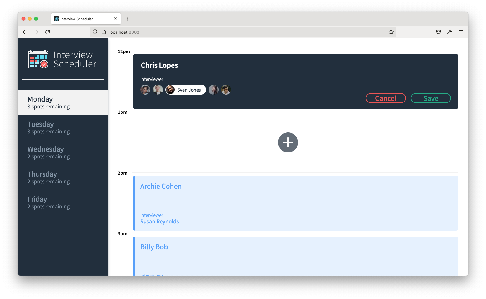

# Interview Scheduler

The scheduler app is a React app that allows students to book time with a mentor Monday to Friday between 12:00 and 17:00. Students are able to create a new booking, edit their existing appointment, or delete their appointment.

### Main Page


### Add a Booking



### Hover to Edit/Delete


### Delete Appointment Confirmation


<br>

## Developer Notes

Install dependencies with `npm install`.

## Running Webpack Development Server

```sh
npm start
```

## Running Jest Test Framework

```sh
npm test
```

## Running Storybook Visual Testbed

```sh
npm run storybook
```

## API Data

"GET_DAYS": http://localhost:8001/api/days,
"GET_APPOINTMENTS": http://localhost:8001/api/appointments,
"GET_INTERVIEWERS": http://localhost:8001/api/interviewers,
